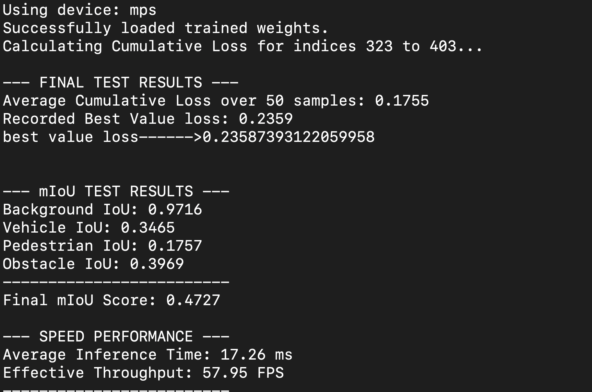
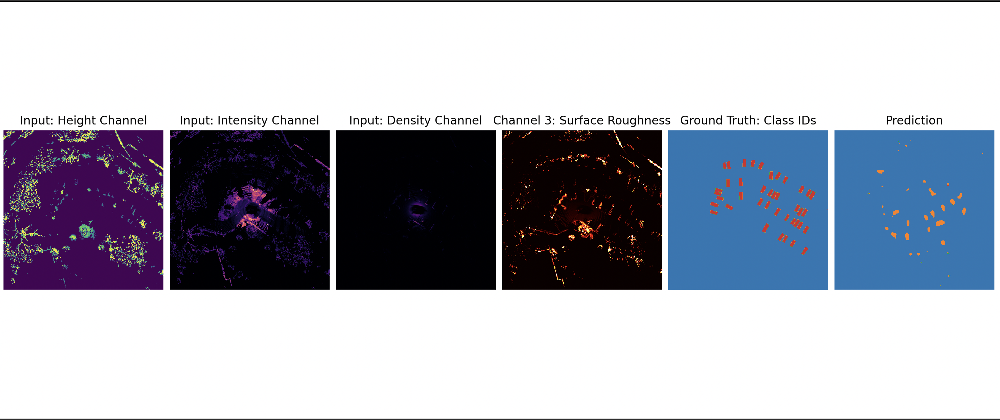
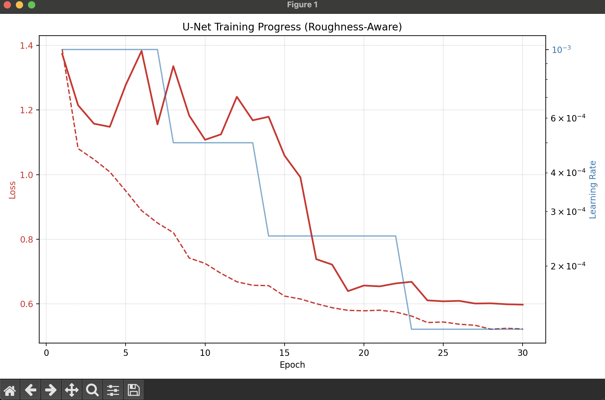

# PathBalancer: High-Frequency BEV Perception for EV Safety
**Real-time Semantic Segmentation for autonomous navigation using 4-channel LiDAR tensors.**

---

## Project Overview
PathBalancer is a high-efficiency perception engine designed to bridge the gap between heavy 3D point cloud processing and real-time embedded constraints. By projecting sparse LiDAR data into a 2D Bird’s Eye View (BEV) and utilizing a novel **Surface Roughness** feature, the system achieves autonomous-grade spatial awareness at a fraction of the traditional computational cost.

---

## Model Architecture
The architecture utilizes a **MobileNetV3-Small** encoder paired with a custom **U-Net** decoder. This hybrid approach leverages depth-wise separable convolutions to maintain a lightweight parameter count while using skip connections to recover fine-grained spatial details lost during downsampling.

* **Input Tensor:** 400x400x4 (Height, Intensity, Density, Roughness)
* **Optimization:** Exported via **ONNX Runtime** for hardware-accelerated inference

---

## Dataset
* **Source:** [nuScenes](https://www.nuscenes.org/) (Full Open Dataset)
* **Preprocessing:** 10-sweep temporal aggregation to mitigate sensor sparsity
* **Classes:** Road, Vehicle, Pedestrian, and Obstacle
* **Required:** place your dataset under `/trainingData` before running preprocessing or model evaluation

---

## Setup & Installation

```bash
# Clone the repository
git clone https://github.com/<Your-Username>/PathBalancer.git
cd PathBalancer

# Install dependencies
pip install -r requirements.txt

# Optional: ONNX Runtime for hardware acceleration
pip install onnxruntime-silicon
```

---

## Preprocessing
Preprocessing is required before any model testing or inference.

```bash
python3 preprocess_dataset.py
```

The dataset must be available in `trainingData/`. Output files will be written to `processed_data/`.

---

## How To Run

### Test models

```bash
python3 testModel.py
python3 testModel_mobile.py
```

Edit the flags inside the respective files to test different input ranges.

### Live data reader

```bash
python3 run_modularizer.py
```

Output is logged in `driving_log.txt`. Port `2368` must be exposed to the VLP-16 LiDAR stream, or use a custom simulator.

---

## Notes

* Always run preprocessing before testing or inference.

## Example output and results

## Assets






